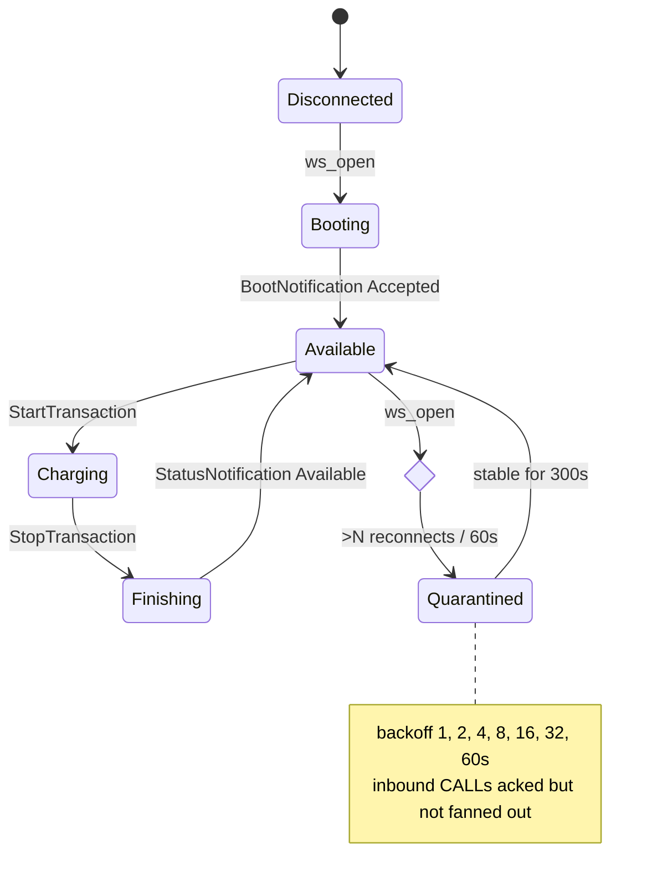

# ocpp-bench

I built this because I spent a few years running an EV charging network at
[charge-me.energy](https://charge-me.energy) and the things that broke in
production were never the ones the OCPP spec warned about: it was the
reconnect storms, the chargers that take 30 seconds to answer, the ones
that send the same StartTransaction twice, the ones that flap faster than
anyone's dashboard refreshes. `ocpp-bench` is a minimal-but-correct OCPP
1.6J / 2.0.1 central system plus a station simulator that drives it, or
any other CSMS, through those exact scenarios. It is not a product. It is
a reference implementation that behaves the way I wish every CSMS behaved
when the field gets ugly.

[](https://github.com/tiger19935/ocpp-bench/actions/workflows/ci.yml)

## Quick start

```
git clone git@github.com:tiger19935/ocpp-bench.git && cd ocpp-bench
make install
docker compose up -d --build
```

Then from the host:

```
uv run ocpp-bench sim \
  --target ws://localhost:9000/ocpp \
  --scenario normal \
  --stations 50 \
  --admin-url http://localhost:9100
```

Prometheus is at `http://localhost:9090`. Grafana (optional, behind the
`grafana` compose profile) is at `http://localhost:3000`.

## Scenarios

| Name                       | What it does                                                      |
|---------------------------|-------------------------------------------------------------------|
| normal                    | Each station completes one charging session end to end            |
| soak                      | N stations heartbeat for M seconds                                |
| reconnect-storm           | All stations drop and reconnect inside a tight window             |
| burst                     | Each station sends 1 Hz Heartbeat + 0.5 Hz MeterValues under load |
| flapping                  | One station reconnects every X ms while N stable stations run     |
| slow-consumer             | Station delays its response past the CSMS call timeout            |
| duplicate-start           | Two identical StartTransaction CALLs within the dedupe window     |
| out-of-order-metervalues  | MeterValues sent with reversed timestamps                         |
| oversized-metervalues     | A single large MeterValues payload                                |
| boot-loop                 | BootNotification every N seconds, several times                   |

Scenario YAML lives in `scenarios/`. `docs/failure-modes.md` maps each
scenario to the CSMS behaviour it exercises and the test that pins it.

## How quarantine works

A charger that reconnects faster than the flap threshold is quarantined.
Its connection is accepted and acked (closing would make the storm
worse), its FSM freezes, and its next reconnect is throttled by an
exponential backoff. See `docs/adr/0001-per-device-quarantine.md`.



## Measured load

| Field                | Value                                                        |
|----------------------|--------------------------------------------------------------|
| Host                 | Darwin 25.3.0 arm64, 10 CPU cores, 64 GiB RAM                |
| Container runtime    | Docker 29.1.3                                                |
| Stations             | 1 000                                                        |
| Duration             | 60 s                                                         |
| CSMS container RSS   | 123.5 MiB (steady, measured via `docker stats --no-stream`)  |
| Boot round-trip      | p50 311 ms   p95 399 ms   p99 448 ms   max 468 ms            |
| Heartbeat round-trip | p50 43 ms   p95 214 ms   p99 320 ms   max 368 ms             |
| Message throughput   | ≈ 100 msg/s sustained (6 000 heartbeats + 1 000 boots / 60s) |

Boot latency includes the TCP + websocket handshake and 1 000 concurrent
connects landing on the same event loop. Reproduce with:

```
ulimit -n 4096
docker compose up -d --build
uv run ocpp-bench sim \
  --target ws://localhost:9000/ocpp \
  --scenario soak \
  --stations 1000 --duration 60 \
  --no-assert-csms \
  --report-json load.json
docker stats --no-stream ocpp-bench-csms-1
```

## Running against a third-party CSMS

Use `--no-assert-csms` to skip the admin-endpoint assertions. See
`docs/running-against-other-csms.md` for which scenarios still apply
cleanly without this repo's CSMS in the loop.

## Out of scope

- Persistent storage. State is held in process memory behind a
  `StationStore` Protocol so a backing store is a drop-in; the point of
  this harness is correctness under adversarial inputs, not durability.
- Authentication/authorisation beyond accepting the OCPP subprotocol.
  The admin HTTP surface has no auth; put it behind a VPN or a reverse
  proxy with mTLS when deploying.
- Smart charging profiles beyond echoing accepted responses.

## License

MIT. See `LICENSE`.
